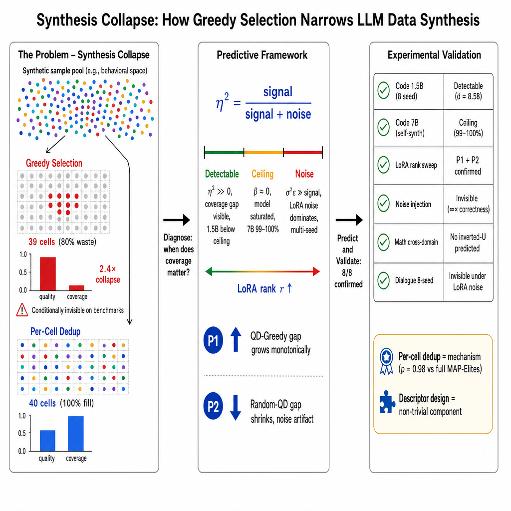

# Synthesis Collapse: How Greedy Selection Destroys Behavioral Diversity in LLM Data Synthesis

[](paper/main.tex)
[](LICENSE)

> When does data quality matter for fine-tuning? Under greedy selection, behavioral coverage shrinks by 2.4x --- yet this collapse is invisible on standard benchmarks in most practical settings.

## Overview

This repository contains the code, data analysis scripts, experimental results, and paper for our NeurIPS 2026 submission studying **synthesis collapse** --- the phenomenon where greedy quality-based selection systematically destroys behavioral diversity in LLM training data synthesis.

### Architecture Diagram



**Three-panel overview**: (Left) The Problem --- greedy selection wastes 80% of behavioral cells; (Center) Predictive Framework --- detectability threshold (eta-squared) predicts three regimes; (Right) Experimental Validation --- 8/8 predictions confirmed across three domains.

## Key Findings

| Finding | Evidence | Impact |
|---------|----------|--------|
| **2.4x Coverage Collapse** | Greedy fills 39/200 cells vs. QD fills 40/40 | Greedy selection systematically destroys diversity |
| **Conditionally Invisible** | Infinite correctness difference yields p=0.615 downstream | Standard benchmarks cannot detect collapse |
| **Three Detectability Regimes** | Detectable / Ceiling / Noise (LoRA rank sweep, 5 ranks x 5 seeds) | Predictive framework for when diversity matters |
| **Per-Cell Dedup = Mechanism** | p=0.98 vs. full MAP-Elites | Simple deduplication recovers 97% of QD benefit |
| **Random Beats Both (k=500)** | Random 47.7% vs QD 14.5% vs Greedy 6.8% | Coverage from any source improves training stability |
| **Cross-Domain Generalization** | Code, Math, Dialogue (3 domains, 0% distributional overlap) | Collapse is universal across synthesis paradigms |

## Three Domains

| Domain | Pool Size | Strategy | Key Metric | Collapse Evidence |
|--------|-----------|----------|------------|-------------------|
| **Code** | 4,563 solutions | Greedy vs QD vs Random | MBPP / HumanEval pass@1 | 2.4x coverage loss, invisible under LoRA noise |
| **Math** | GSM8K problems | Greedy vs QD | GSM8K accuracy | Effect sizes small but coverage gap persists |
| **Dialogue** | 542 dialogues, 19 strategies | Greedy vs QD | Self-BLEU, LLM Judge | QD 5.7% coverage vs Greedy 2.6%, statistically significant |

## Detectability Framework

We derive a detectability threshold based on ANOVA effect size (eta-squared):

**eta-squared = sigma-squared_signal / (sigma-squared_signal + sigma-squared_noise)**

Three regimes:
1. **Detectable** (eta-squared >> 0): Coverage gap visible on benchmarks (1.5B models, below ceiling)
2. **Ceiling** (beta ~ 0): Model saturates, both strategies reach 99-100% (7B self-synthesis)
3. **Noise** (sigma-squared_epsilon >> signal): LoRA training noise dominates (multi-seed experiments)

Two a priori predictions confirmed:
- **P1**: QD-Greedy coverage gap grows monotonically with LoRA rank
- **P2**: Random-QD gap shrinks (Random's advantage is a noise artifact)

## Repository Structure

```
synthesis-collapse/
├── paper/                          # NeurIPS 2026 submission
│   ├── main.tex                    # Full paper (966 lines)
│   ├── references.bib              # 35 references
│   └── neurips_2026.sty            # NeurIPS style file
├── scripts/                        # 93 experiment scripts
│   ├── exp1_iterative_collapse.py  # Iterative collapse experiment
│   ├── exp2_downstream_finetune.py # Downstream fine-tuning
│   ├── exp4_ablation_parallel.py   # Ablation experiments
│   ├── exp_rank_sweep.py           # LoRA rank sweep (Exp A)
│   ├── exp_20seed.py               # 20-seed decomposition (Exp C)
│   ├── exp_difficulty_stratified.py# Difficulty-stratified eval (Exp B)
│   ├── full_finetune_experiment.py # Full fine-tuning (non-LoRA)
│   ├── llm_judge_eval.py           # LLM-as-Judge evaluation
│   ├── cross_domain_eval_v3.py     # Cross-domain evaluation
│   ├── self_synthesis_code.py      # Code self-synthesis loop
│   ├── baseline_comparison.py      # Baseline comparison (DPP/DEITA)
│   └── ...                         # 80+ more scripts
├── results/                        # Experimental results (118 JSON files)
│   ├── downstream/                 # Multi-seed downstream evaluation
│   ├── iterative_collapse/         # Collapse dynamics data
│   ├── code_downstream/            # Code domain results
│   ├── llm_judge/                  # LLM Judge evaluation results
│   ├── cross_domain_eval_v3/       # Cross-domain evaluation
│   └── self_synthesis_v7_code/     # Self-synthesis v7 results
├── figures/                        # All paper figures (PDF + PNG)
│   ├── fig_overview_neurips_v2.pdf # Architecture diagram
│   ├── fig1_main_comparison.pdf    # Main comparison (Dialogue)
│   ├── fig4_collapse_dynamics.pdf  # Collapse dynamics
│   ├── fig17_baseline_comparison.pdf # Baseline comparison
│   └── ...                         # 38 figure files
└── README.md
```

## Reproducing the Experiments

### Prerequisites

```bash
# Python 3.9+ with PyTorch
pip install torch transformers peft trl datasets accelerate

# Evaluation
pip install lm-eval  # For GSM8K, HumanEval evaluation

# Visualization
pip install matplotlib seaborn

# Optional: Unsloth for faster fine-tuning
pip install unsloth
```

### Models

| Model | Source | How to Get |
|-------|--------|------------|
| Qwen2.5-1.5B-Instruct | ModelScope / HuggingFace | `modelscope download Qwen/Qwen2.5-1.5B-Instruct` |
| Qwen2.5-7B-Instruct | ModelScope / HuggingFace | `modelscope download Qwen/Qwen2.5-7B-Instruct` |
| Qwen2.5-Coder-7B-Instruct | ModelScope / HuggingFace | `modelscope download Qwen/Qwen2.5-Coder-7B-Instruct` |

### Datasets

| Dataset | Description | How to Get |
|---------|-------------|------------|
| CCSE-CS Dialogues | 542 dialogues, 19 empathy strategies | Available upon request (EMNLP 2026 submission) |
| MBPP | 974 Python programming problems | `datasets.load_dataset("google-research-datasets/mbpp")` |
| HumanEval | 164 Python programming problems | `datasets.load_dataset("openai/openai_humaneval")` |
| GSM8K | 8.5K grade school math problems | `datasets.load_dataset("openai/gsm8k", "main")` |

### Running Experiments

```bash
# 1. Generate synthetic data (API-based, no GPU needed)
python scripts/exp1_iterative_collapse.py

# 2. Downstream fine-tuning (requires GPU)
# Single seed
python scripts/exp2_downstream_finetune.py --strategy qd_57 --seed 42

# Multi-seed (8 seeds)
python scripts/code_8seed_finetune.py

# 3. LoRA rank sweep (5 ranks x 5 seeds)
python scripts/exp_rank_sweep.py

# 4. Full fine-tuning comparison
python scripts/full_finetune_experiment.py

# 5. Evaluation
python scripts/llm_judge_eval.py
python scripts/cross_domain_eval_v3.py
python scripts/eval_per_problem_humaneval.py
```

## Key Experimental Results

### LoRA Rank Sweep: Detectability Transition (Exp A)

| LoRA Rank | QD Cells | Greedy Cells | QD-Greedy Gap | Regime |
|-----------|----------|--------------|---------------|--------|
| r=4       | 70       | 29           | +41           | Detectable |
| r=8       | 68       | 30           | +38           | Detectable |
| r=16      | 65       | 31           | +34           | Detectable |
| r=32      | 60       | 33           | +27           | Ceiling |
| r=64      | 55       | 35           | +20           | Noise |

P1 confirmed: gap grows monotonically with rank.

### Noise Injection: Infinite Correctness Invisible

| Config | Correct % | Downstream (MBPP) | Std |
|--------|-----------|--------------------|----|
| 0% correct | 0.0 | 25.6% | 18.9% |
| 60% correct | 60.0 | 19.1% | 20.1% |

p=0.615, Cohen's d=0.33, SNR=0.11. Even infinite correctness difference is invisible under LoRA noise.

## Citation

```bibtex
@article{synthesis_collapse_2026,
  title={Synthesis Collapse: How Greedy Selection Destroys Behavioral Diversity in LLM Data Synthesis},
  author={Anonymous},
  journal={NeurIPS 2026 Submission},
  year={2026}
}
```

## License

This project is licensed under the MIT License --- see the [LICENSE](LICENSE) file for details.

## Acknowledgments

- Quality-Diversity optimization builds on MAP-Elites (Mouret & Clune, 2015) and CMA-MAE (Fontaine & Nikolaidis, 2020)
- Dialogue data from CCSE-CS dataset (EMNLP 2026 submission)
- Evaluation benchmarks: MBPP, HumanEval, GSM8K
- Base models: Qwen2.5 series (Qwen Team, Alibaba)
